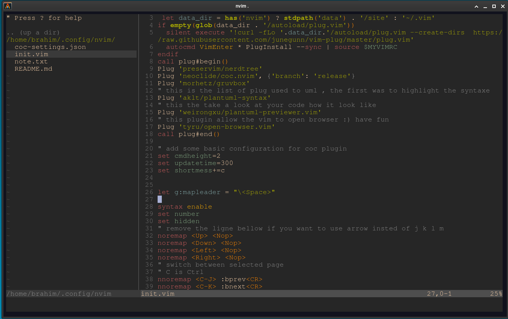

<p align="center">


</p>
### Introduction :
My personal vim configuration with minimal plugins  

### Installation Process : 
 
- [install neovim command](https://github.com/neovim/neovim)

- clone the configuration file and add it to ~/.config/nvim directory

```
git clone https://github.com/oueslati00/personalVim ~/.config/nvim
``` 
- write this command to install the plugin 
```
:PlugInstall 
```
- to add autocomplete for specifique language like java ( you can find more information in https://www.npmjs.com/package/coc-java
 ```
 :CocInstall coc-java
 ```
- after every plugin modification you should close and open the nvim 

### recommendation :
- [fonts](https://github.com/powerline/fonts) used for nerdtree plugin

### test :
-  tested with [alacritty](https://github.com/alacritty/alacritty) terminal and work fine 
